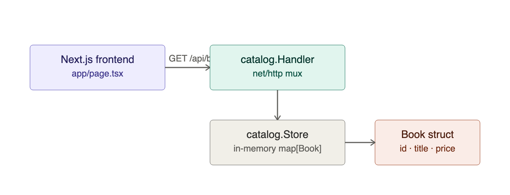
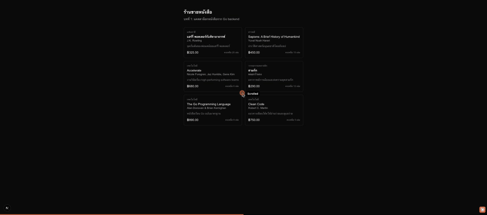

# บทที่ 1: แคตตาล็อกหนังสือ (Go API + Next.js)

## เรียนบทนี้ไปทำไม

ก่อนจะสอน agent ให้ฉลาดในบทถัดไป ต้องมี "แหล่งข้อมูลสินค้า" ที่เชื่อถือได้ก่อน บทนี้จึงปูพื้นฐาน
การสร้าง REST API ด้วย Go ล้วน ๆ (ไม่พึ่ง framework ใหญ่) และการต่อ Next.js เข้ากับ API นั้น
เพื่อให้เห็นภาพชัดว่า agent ในบทหลัง ๆ จะ "คุยกับระบบหลังบ้านตัวเดียวกัน" นี้อย่างไร

## เป้าหมาย (goal)

1. อธิบายได้ว่าทำไมต้องแยก backend (Go) กับ frontend (Next.js) ออกจากกัน
2. สร้าง endpoint `GET /api/books` และ `GET /api/books/{id}` ด้วย `net/http` มาตรฐานของ Go 1.22+
   (ใช้ pattern matching แบบใหม่ `GET /api/books/{id}` แทนการ route เอง)
2. เก็บข้อมูลหนังสือแบบ in-memory (`catalog.Store`) พร้อม thread-safety ด้วย `sync.RWMutex`
3. แสดงรายการหนังสือในหน้าเว็บ Next.js โดย fetch จาก backend

## สถาปัตยกรรมของบทนี้



## โครงสร้างโค้ด

```
server/
  cmd/server/main.go          - จุดเริ่มต้นโปรแกรม, wiring HTTP server
  internal/catalog/book.go    - struct Book
  internal/catalog/store.go   - in-memory store + seed data
  internal/catalog/handler.go - HTTP handlers

web/
  app/page.tsx                - แสดงรายการหนังสือ (server component)
  lib/api.ts                  - fetch wrapper + type Book
```

## ทำไมเลือก `net/http` เปล่า ๆ แทน framework

Workshop นี้เน้นให้เห็น **กลไกจริงของ ACP** (JSON, HTTP status, webhook) ไม่ใช่ magic ของ
framework ใดๆ Go 1.22 ขึ้นไปรองรับ path parameter (`{id}`) และ method matching
(`GET /path`) ใน `http.ServeMux` มาตรฐานอยู่แล้ว จึงไม่จำเป็นต้องพึ่ง Gin/Echo สำหรับ workshop
ขนาดนี้

## วิธีรันบทนี้

```bash
# terminal 1: backend
cd server && go run ./cmd/server

# terminal 2: frontend
cd web && npm run dev
```

เปิด http://localhost:3000 จะเห็นรายการหนังสือ 6 เล่มที่ backend seed ไว้

## ผลลัพธ์ที่ควรได้



## ทดสอบ

```bash
cd server && go test ./...
```

ครอบคลุม: ค้นหาแบบ case-insensitive, ค้นหาด้วย query ว่าง, และการตัด stock (`ReserveStock`)
ที่จะถูกใช้จริงในบทที่ 4 (ตะกร้าสินค้า)

## สรุปสิ่งที่ได้เรียนรู้

- โครงสร้างขั้นต่ำของ REST API ด้วย Go มาตรฐาน
- การแยก layer: handler → store → data model
- การต่อ Next.js server component เข้ากับ backend คนละ process
- เขียน unit test ให้ business logic (การค้นหา, การตัด stock) แยกจาก HTTP layer
