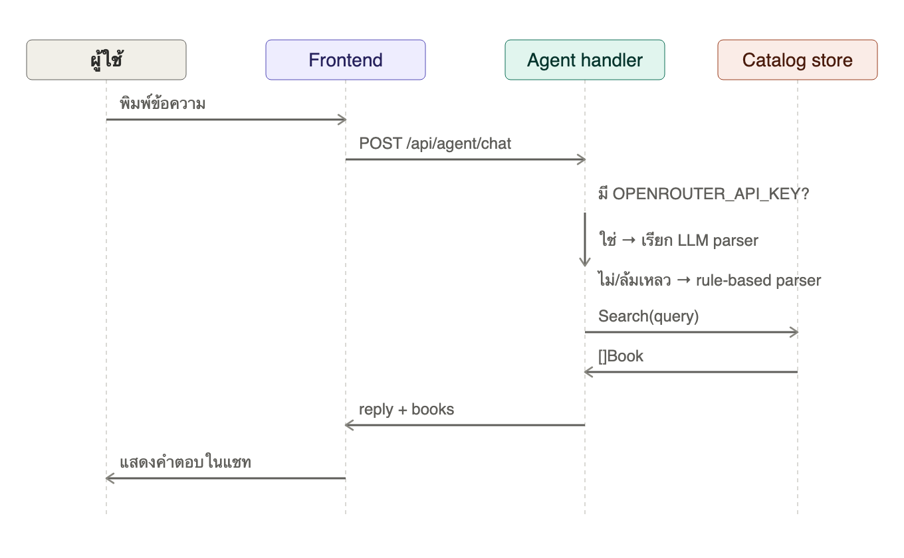
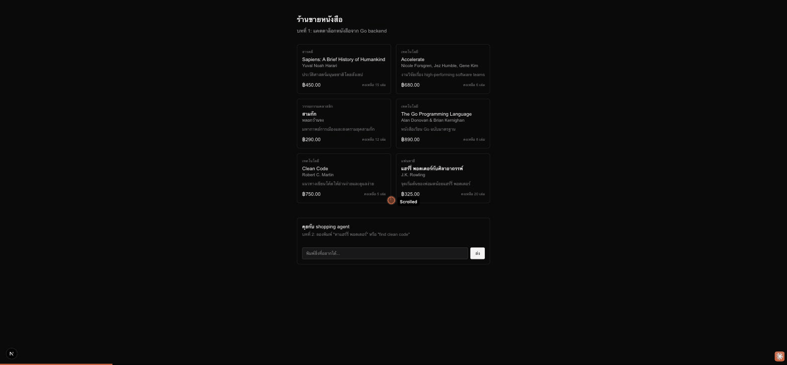

# บทที่ 2: Shopping agent — แปลความต้องการผู้ใช้

## เรียนบทนี้ไปทำไม

หัวใจของระบบ agentic commerce คือการให้ agent "ฟังภาษาคน" แล้วแปลงเป็น action ที่ระบบเข้าใจได้
บทนี้สอนสองแนวทางที่ใช้ร่วมกันได้จริงในโปรดักชัน: **rule-based parser** ที่เร็ว ฟรี และคาดเดาผลได้
เสมอ กับ **LLM-backed parser** ที่ยืดหยุ่นกว่าแต่ต้องพึ่งพา API ภายนอก ประเด็นสำคัญคือระบบต้อง
ไม่พังเมื่อ LLM ใช้ไม่ได้ — นี่คือหลักการ graceful degradation ที่ระบบ production จริงต้องมี

## เป้าหมาย (goal)

1. ออกแบบ `Intent` ที่เป็นตัวกลางระหว่างข้อความอิสระกับ action ของระบบ
2. เขียน `RuleParser` ที่ตัดคำฟุ่มเฟือย (filler words) ภาษาไทย/อังกฤษออก แล้วเหลือ query สำหรับค้นหา
3. เขียน `LLMParser` ที่เรียก OpenRouter API และ parse JSON output เป็น `Intent`
4. ทำให้ `Agent` เลือกใช้ LLM ก่อนถ้ามี key และ fallback เป็น rule-based โดยอัตโนมัติเมื่อไม่มี
   key หรือเรียก LLM ไม่สำเร็จ — สอดคล้องกับ `.env.example` ที่ระบุว่า "ไม่มี key ก็ไม่เสีย
   functionality"
5. สร้างหน้าจอแชทฝั่ง Next.js ที่คุยกับ agent ได้

## ลำดับการทำงาน



## โครงสร้างโค้ดที่เพิ่มเข้ามา

```
server/internal/agent/
  intent.go        - IntentKind, Intent
  rule_parser.go    - deterministic parser (ไม่พึ่ง network)
  llm_parser.go      - OpenRouter client (optional)
  agent.go          - orchestration + graceful fallback
  handler.go         - POST /api/agent/chat

web/
  lib/agent.ts               - fetch wrapper สำหรับ chat API
  components/ChatPanel.tsx   - หน้าจอแชท (client component)
```

## ทำไม fallback ต้องเป็น "silent" ไม่ใช่ error

ถ้า `LLMParser.Parse` คืน error (network ล่ม, quota หมด, JSON parse ไม่ได้) `Agent.resolveIntent`
จะเงียบ ๆ เปลี่ยนไปใช้ `RuleParser` ทันที ผู้ใช้จะไม่เห็น error เลย เพราะจากมุมมองธุรกิจ
"ตอบช้ากว่าฉลาดนิดหน่อย" ดีกว่า "ตอบไม่ได้เลย" — ตรงตามที่ `.env.example` สัญญาไว้ตั้งแต่บทนี้

## วิธีลองใช้ LLM parser

```bash
# server/.env หรือ export ตรง ๆ
export OPENROUTER_API_KEY=sk-or-...
cd server && go run ./cmd/server
```

จะเห็น log `shopping agent: LLM-backed intent parsing enabled (OpenRouter)` แทนข้อความ
rule-based ปกติ

## ผลลัพธ์ที่ควรได้



## ทดสอบ

```bash
cd server && go test ./internal/agent/...
```

ครอบคลุม: การทักทาย, การตัด filler words ภาษาไทย/อังกฤษ, กรณีค้นหาไม่เจอ (ต้องตอบแบบสุภาพ
ไม่ crash)

## สรุปสิ่งที่ได้เรียนรู้

- การออกแบบ intent เป็น data structure กลาง แยกจาก parser implementation
- Rule-based parsing เพียงพอสำหรับ MVP และเป็น safety net ที่ดีสำหรับ LLM
- หลักการ graceful degradation: ฟีเจอร์เสริม (LLM) ต้องไม่ทำให้ core flow พังเมื่อขาดหายไป
- การสร้าง client component ใน Next.js App Router สำหรับ UI ที่ต้องมี state (แชท)
