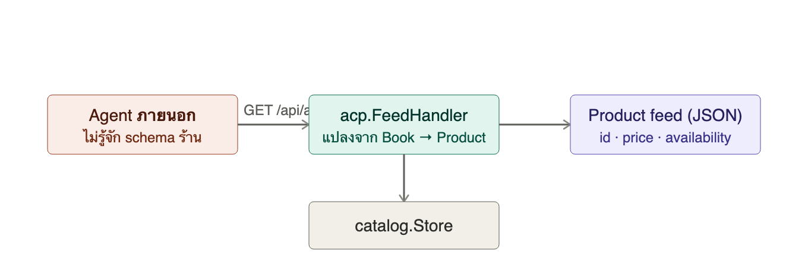
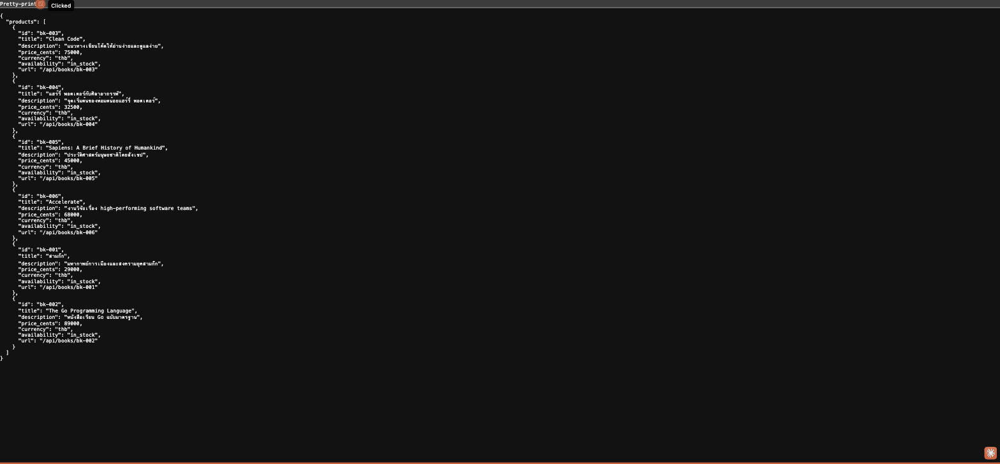

# บทที่ 3: ACP product feed & discovery

## เรียนบทนี้ไปทำไม

จนถึงบทที่ 2 shopping agent ของเรารู้จักหนังสือเพราะมันเรียก `catalog.Store` ตรง ๆ ซึ่งใช้ได้กับ
agent ที่เราเขียนเอง แต่ **หัวใจของ ACP คือการเปิดให้ agent ภายนอก** (เช่น ChatGPT, agent ของ
แพลตฟอร์มอื่น) ค้นพบสินค้าของร้านได้โดยไม่ต้องรู้จัก schema ภายในของเรา บทนี้จึงแยก
"product feed" ออกมาเป็น public contract ต่างหากจาก internal API ของบทที่ 1

> หมายเหตุ: นี่คือ subset ของแนวคิด ACP ที่ทำขึ้นเพื่อการศึกษา ไม่ใช่การ implement ตามสเปกแบบ
> ครบถ้วนหรือผ่านการรับรอง

## เป้าหมาย (goal)

1. เข้าใจความแตกต่างระหว่าง "internal API" (บทที่ 1) กับ "public discovery feed" (บทนี้)
2. ออกแบบ `acp.Product` ที่เป็น contract คงที่ ไม่ผูกกับโครงสร้าง `catalog.Book` ภายใน
   โดยตรง — ถ้าวันหนึ่งเปลี่ยนโครงสร้างข้อมูลภายใน feed จะไม่พังตาม
3. สร้าง endpoint `GET /api/acp/products` ที่ตอบ availability ตาม stock จริง

## สถาปัตยกรรมของบทนี้



## ทำไมต้องแปลง `Book` เป็น `Product` แยกกัน

`catalog.Book` มีฟิลด์ `stock` (ตัวเลขคงเหลือ) ซึ่งเป็นรายละเอียดภายในที่ร้านไม่อยากเปิดเผย
ตัวเลขจริงให้ agent ภายนอกเห็น (คู่แข่งอาจสอดแนมสต๊อกได้) จึงแปลงเป็น `availability` แบบ
`in_stock` / `out_of_stock` แทน — นี่คือหลักการ **อย่า leak internal model ผ่าน public
contract**

## ผลลัพธ์ที่ควรได้

```bash
curl -s localhost:3001/api/acp/products | jq
```



## ทดสอบ

```bash
cd server && go test ./internal/acp/...
```

ครอบคลุม: การแปลง stock หมดเป็น `out_of_stock`, feed ครบทุกเล่มในแคตตาล็อก

## สรุปสิ่งที่ได้เรียนรู้

- แนวคิด product feed ของ ACP: จุดเดียวที่ agent ใด ๆ ค้นพบสินค้าได้โดยไม่ผูกกับ internal schema
- การออกแบบ DTO (`Product`) แยกจาก domain model (`Book`) เพื่อควบคุมว่าจะ expose อะไรบ้าง
- บทถัดไปจะใช้ `Product` เดียวกันนี้เป็นวัตถุดิบสร้าง checkout session
