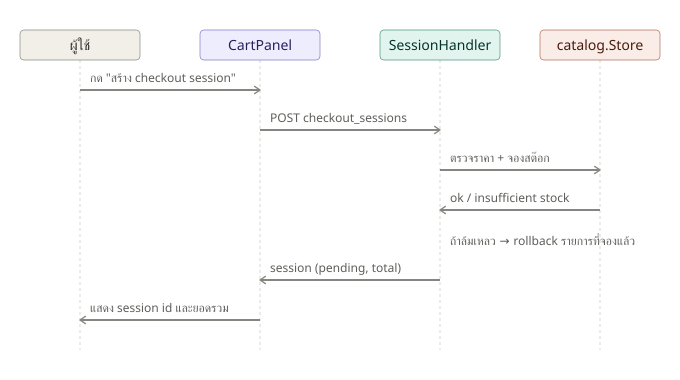
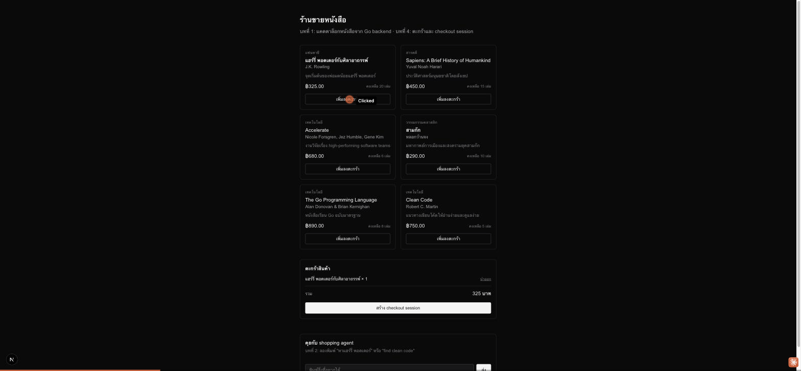

# บทที่ 4: ตะกร้าสินค้าและ ACP checkout session

## เรียนบทนี้ไปทำไม

ก่อนจะจ่ายเงินจริงในบทที่ 5 ต้องมี "หน่วยที่แทนความตั้งใจจะซื้อ" ที่ชัดเจนก่อน — นี่คือหน้าที่ของ
**checkout session** ตามแนวคิด ACP บทนี้สอนสอง pattern สำคัญที่ระบบชำระเงินจริงต้องมี:
(1) ห้ามเชื่อราคาที่ client ส่งมา ต้องคำนวณใหม่จากฝั่ง server เสมอ และ (2) ต้องจองสต๊อกตอนสร้าง
session ไม่ใช่ตอนจ่ายเงินสำเร็จ ไม่งั้นหนังสือเล่มสุดท้ายอาจถูกขายซ้ำให้สองคนพร้อมกัน

## เป้าหมาย (goal)

1. ออกแบบ `CheckoutSession` พร้อม `SessionStatus` lifecycle: `pending` →
   `ready_for_payment` (บทที่ 5) → `completed` (บทที่ 7) หรือ `canceled`
2. สร้าง `POST /api/acp/checkout_sessions` ที่รับแค่ `product_id` + `quantity` จาก client
   แล้ว **คำนวณราคาใหม่จาก catalog store เสมอ** ไม่เชื่อราคาจาก client
3. จองสต๊อกตอนสร้าง session พร้อม rollback ถ้ารายการใดรายการหนึ่งในตะกร้าจองไม่สำเร็จ
4. สร้างหน้าตะกร้าสินค้าฝั่ง Next.js ด้วย React Context (`useCart`)

## ลำดับการทำงาน



## ทำไมต้อง rollback ทั้งตะกร้าถ้ารายการเดียวจองไม่สำเร็จ

ลองนึกภาพตะกร้ามี 3 เล่ม จองสำเร็จ 2 เล่มแรกแต่เล่มที่ 3 สต๊อกหมดพอดี ถ้าไม่ rollback สต๊อกที่จอง
ไปแล้วของเล่ม 1-2 จะค้างอยู่ทั้งที่ผู้ใช้ยังไม่ได้ checkout สำเร็จ ทำให้หนังสือ "หายไปจากระบบ"
โดยไม่มีใครซื้อจริง `SessionStore.Create` จึงเก็บรายการที่จองสำเร็จแล้วไว้ใน `reserved` และเรียก
`ReleaseStock` คืนทั้งหมดทันทีที่เจอ error ตัวไหนก็ตาม

## โครงสร้างโค้ดที่เพิ่มเข้ามา

```
server/internal/acp/
  session.go          - CheckoutSession, SessionStore (create/get/update)
  session_handler.go  - POST/GET checkout_sessions

server/internal/catalog/
  store.go             - เพิ่ม ReleaseStock (คืนสต๊อกที่จองไว้)

web/
  lib/cart-context.tsx  - React Context ของตะกร้า (client-side only)
  lib/checkout.ts        - เรียก POST checkout_sessions
  components/CartPanel.tsx  - แสดงตะกร้า + ปุ่มสร้าง session
  components/BookGrid.tsx    - เพิ่มปุ่ม "เพิ่มลงตะกร้า" ในการ์ดหนังสือ
```

## ผลลัพธ์ที่ควรได้



## ทดสอบ

```bash
cd server && go test ./internal/acp/...
```

ครอบคลุม: คำนวณยอดรวมถูกต้อง, จองสต๊อกจริง, rollback เมื่อจำนวนเกินสต๊อก, ปฏิเสธสินค้าที่ไม่มีจริง

## สรุปสิ่งที่ได้เรียนรู้

- หลักการ "never trust client-supplied price" — server ต้องคำนวณราคาใหม่เสมอ
- การจองทรัพยากร (stock) แบบ all-or-nothing พร้อม compensating action (rollback)
- React Context สำหรับ state ที่ใช้ร่วมกันหลาย component (ตะกร้า) โดยไม่ต้อง prop drilling
- session ที่สร้างในบทนี้จะถูกใช้ต่อในบทที่ 5 เพื่อสร้าง Stripe PaymentIntent
