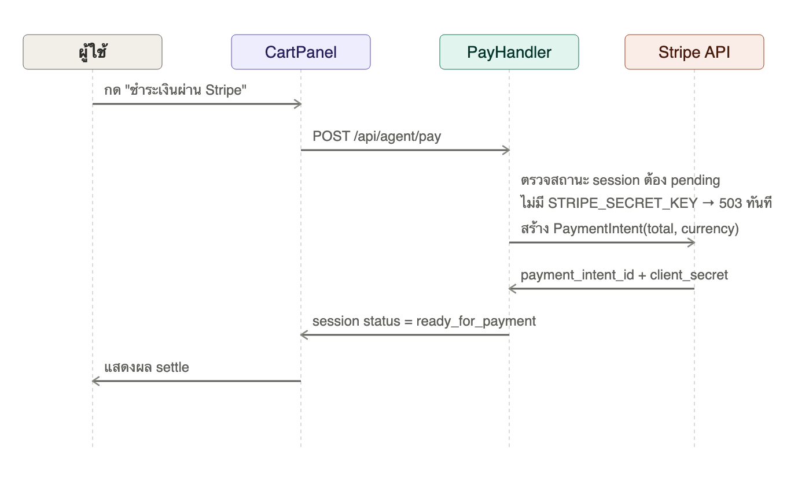
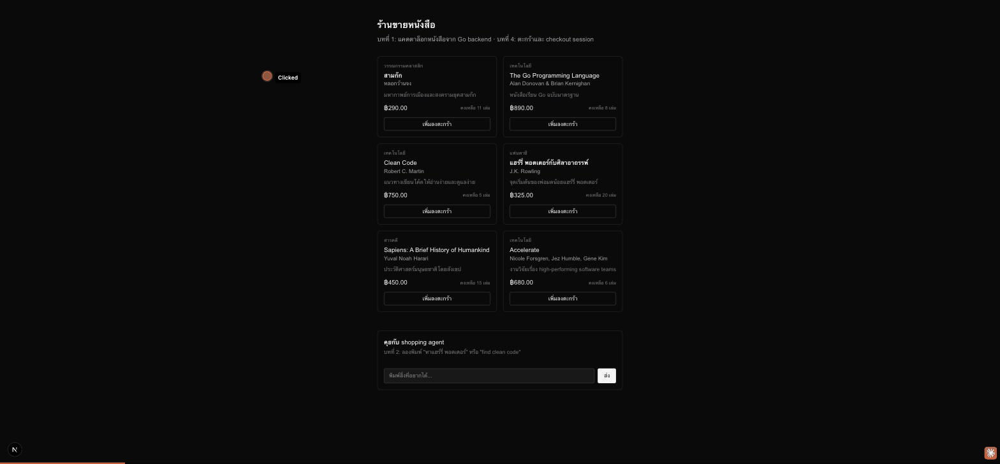

# บทที่ 5: Settle การชำระเงินผ่าน Stripe

## เรียนบทนี้ไปทำไม

นี่คือหัวใจของ workshop ทั้งหมด: **ACP → settle ที่ Stripe** ทุกบทก่อนหน้าปูทางมาถึงจุดนี้
— catalog (บท 1), agent ที่เข้าใจภาษาคน (บท 2), product feed (บท 3), และ checkout session
ที่มีราคาที่ verify แล้ว (บท 4) บทนี้เชื่อมทุกอย่างเข้ากับ Stripe จริงในโหมดทดสอบ (test mode)
เพื่อสร้าง `PaymentIntent` ซึ่งเป็นขั้นตอน "settle" ตามแนวคิด ACP

## เป้าหมาย (goal)

1. เข้าใจว่าทำไม "settle" ต้องเป็นขั้นตอนแยกจากการสร้าง checkout session (บทที่ 4) — agent
   อาจสร้างหลาย session แต่ยังไม่พร้อมจ่ายเงินทันที
2. ใช้ `stripe-go` สร้าง `PaymentIntent` จากยอดรวมของ session ที่คำนวณไว้แล้วฝั่ง server
   (ไม่ใช่ยอดที่ client ส่งมา)
3. ออกแบบ error handling ที่ **แยกความแตกต่างระหว่าง "ระบบพัง" กับ "ยังไม่ได้ตั้งค่า"** —
   ไม่มี `STRIPE_SECRET_KEY` ต้องตอบ `503 Service Unavailable` พร้อมข้อความชัดเจน ไม่ใช่ crash
   หรือ error 500 ที่บอกอะไรไม่ได้
4. ทำให้ session เปลี่ยนสถานะ `pending` → `ready_for_payment` พร้อมเก็บ
   `payment_intent_id` และ `client_secret`

## ลำดับการทำงาน



## ทำไม `/api/agent/pay` ต้องตอบ 503 ไม่ใช่ 500

`503 Service Unavailable` สื่อว่า "บริการนี้ใช้งานไม่ได้ชั่วคราวเพราะ config ไม่ครบ" ซึ่งต่างจาก
`500 Internal Server Error` ที่สื่อว่า "โค้ดมีบั๊ก" ผู้ที่ deploy ระบบนี้ (เช่นทีม DevOps) จะรู้ทันทีว่า
ต้องไปตั้งค่า environment variable ไม่ต้องเปิดดู stack trace `payment.ErrNotConfigured` คือกลไก
ที่ทำให้ `PayHandler` แยกแยะ error สองแบบนี้ได้

```go
settlement, err := h.settler.CreatePaymentIntent(...)
if errors.Is(err, payment.ErrNotConfigured) {
    writeJSON(w, http.StatusServiceUnavailable, ...)
    return
}
```

## โครงสร้างโค้ดที่เพิ่มเข้ามา

```
server/internal/payment/
  stripe.go   - StripeSettler ครอบ stripe-go SDK, ErrNotConfigured

server/internal/acp/
  pay_handler.go  - POST /api/agent/pay

web/
  lib/pay.ts             - เรียก settle + แยก error 503 ออกจาก error อื่น
  components/CartPanel.tsx - ปุ่ม "ชำระเงินผ่าน Stripe (settle)"
```

## การทดสอบแบบไม่มี Stripe key จริง

ในสภาพแวดล้อม workshop นี้ `STRIPE_SECRET_KEY` ยังไม่ถูกตั้งค่า (ดู `.env.example`) ดังนั้น demo
ด้านล่างจะแสดงพฤติกรรม **graceful degradation** — ระบบตอบ 503 อย่างสุภาพแทนที่จะ crash ซึ่งคือ
พฤติกรรมที่ถูกต้องตามที่ออกแบบไว้ ถ้าต้องการเห็น PaymentIntent จริง ให้ตั้งค่า
`STRIPE_SECRET_KEY=sk_test_...` (จาก Stripe Dashboard โหมดทดสอบ) ก่อนรัน server

```bash
export STRIPE_SECRET_KEY=sk_test_...
cd server && go run ./cmd/server
```

## ผลลัพธ์ที่ควรได้



## ทดสอบ

```bash
cd server && go test ./internal/payment/... ./internal/acp/...
```

ครอบคลุม: settler ที่ไม่ได้ตั้งค่าคืน `ErrNotConfigured`, handler ตอบ 503 เมื่อไม่มี key,
handler ตอบ 404 เมื่อ session ไม่มีอยู่จริง

## สรุปสิ่งที่ได้เรียนรู้

- การแยก "settle" ออกจาก "สร้าง session" เป็นขั้นตอนคนละขั้นตามแนวคิด ACP
- หลักการเลือก HTTP status code ให้สื่อความหมาย (503 vs 500) เพื่อ debug ง่ายในโปรดักชัน
- ทำไมต้อง reuse ยอดรวมที่ server คำนวณไว้แล้วแทนที่จะให้ client บอกยอดเงินเอง
- บทถัดไปจะแสดงสถานะคำสั่งซื้อนี้ให้ผู้ใช้เห็นแบบ real-time
