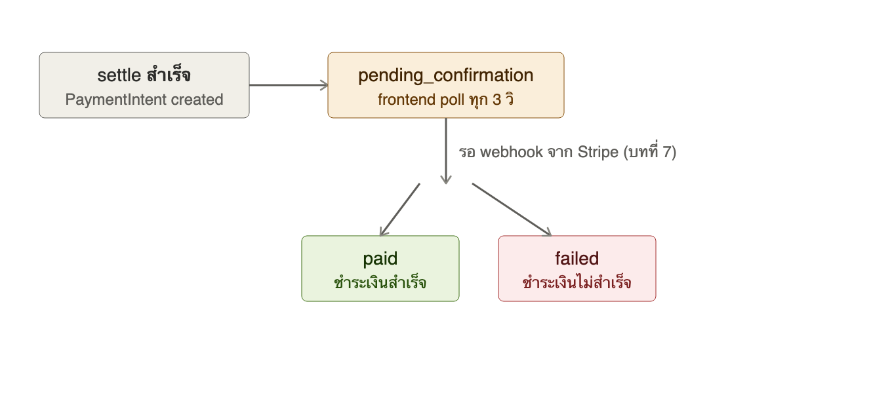
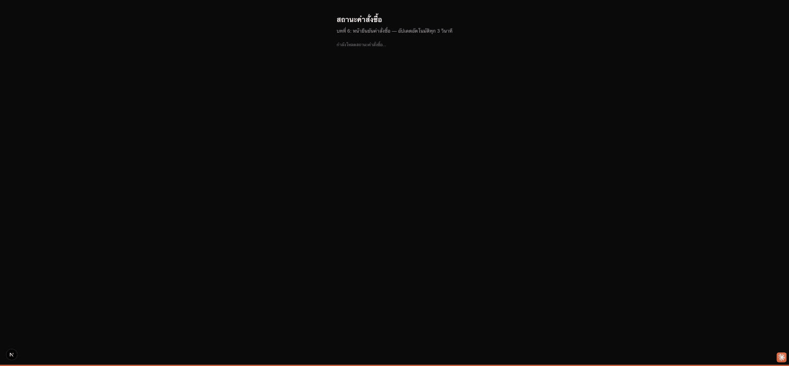

# บทที่ 6: สถานะคำสั่งซื้อและหน้ายืนยัน

## เรียนบทนี้ไปทำไม

บทที่ 5 ทำให้เราสร้าง `PaymentIntent` กับ Stripe ได้ แต่ **การสร้าง PaymentIntent สำเร็จไม่ได้
แปลว่าเงินเข้าจริงแล้ว** — บัตรอาจถูกปฏิเสธ, 3D Secure อาจถูกยกเลิกกลางทาง ฯลฯ บทนี้จึงแยก
"order" ออกจาก "checkout session" อย่างชัดเจน: order มี vocabulary ที่ผู้ใช้เข้าใจง่ายกว่า
(`pending_confirmation`, `paid`, `failed`) และหน้าจอต้อง **poll สถานะ** แทนที่จะเชื่อว่า
"settle สำเร็จ = จ่ายเงินสำเร็จ"

## เป้าหมาย (goal)

1. แยก `Order` ออกจาก `CheckoutSession` — session คือ "ตะกร้าที่พร้อมจ่าย" ส่วน order คือ
   "สิ่งที่ผู้ใช้ต้องรู้สถานะ"
2. สร้าง order สถานะ `pending_confirmation` ทันทีหลัง settle สำเร็จ (บทที่ 5)
3. สร้างหน้า `/orders/[id]` ที่ poll `GET /api/orders/{id}` ทุก 3 วินาทีจนกว่าสถานะจะไม่ใช่
   `pending_confirmation` อีกต่อไป
4. เข้าใจว่าทำไมสถานะ `paid` ต้องมาจาก webhook เท่านั้น (บทที่ 7) ไม่ใช่จาก response ตอน
   สร้าง PaymentIntent

## ลำดับสถานะ



## เครื่องมือช่วยสอน: `/api/dev/seed_order`

Workshop นี้ไม่ได้ผูก Stripe account จริง (ไม่มี `STRIPE_SECRET_KEY`) จึงไม่มีทางเดินผ่าน flow
`/api/agent/pay` จริงเพื่อสร้าง order ได้ บทนี้จึงเพิ่ม endpoint พิเศษ
`POST /api/dev/seed_order` ที่สร้าง order สถานะ `pending_confirmation` ตรง ๆ สำหรับสาธิต
หน้า UI และทดสอบ webhook ในบทที่ 7 **endpoint นี้ไม่ใช่ส่วนหนึ่งของ ACP และไม่ควรมีอยู่ใน
โปรดักชันจริง** — ดูคอมเมนต์ใน `server/internal/acp/dev_handler.go`

```bash
curl -X POST localhost:3001/api/dev/seed_order \
  -H 'Content-Type: application/json' \
  -d '{"total_cents": 32500, "currency": "thb"}'
```

## โครงสร้างโค้ดที่เพิ่มเข้ามา

```
server/internal/acp/
  order.go          - Order, OrderStatus, OrderStore
  order_handler.go  - GET /api/orders/{id}
  dev_handler.go     - POST /api/dev/seed_order (เครื่องมือสอนเท่านั้น)

web/
  lib/pay.ts                 - เพิ่ม fetchOrder, type Order
  components/OrderStatus.tsx - polling component
  app/orders/[id]/page.tsx    - หน้ายืนยันคำสั่งซื้อแบบเต็มหน้า
```

## ผลลัพธ์ที่ควรได้



## ทดสอบ

```bash
cd server && go test ./internal/acp/...
```

ครอบคลุม: order เริ่มต้นที่ `pending_confirmation`, ค้นหา order ด้วย payment intent id
(ใช้ในบทที่ 7), การ confirm order พร้อม timestamp

## สรุปสิ่งที่ได้เรียนรู้

- การแยก "สถานะภายใน" (session) ออกจาก "สถานะที่ผู้ใช้เห็น" (order) เพื่อลดความสับสน
- Polling pattern สำหรับ UI ที่ต้องรอ asynchronous confirmation
- หลักการ "อย่าเชื่อว่า API call สำเร็จ = business outcome สำเร็จ" สำหรับระบบการเงิน
- เทคนิคสร้างเครื่องมือ dev-only สำหรับสาธิต/ทดสอบ flow ที่พึ่งพา external service โดยไม่ต้อง
  มี credential จริง
