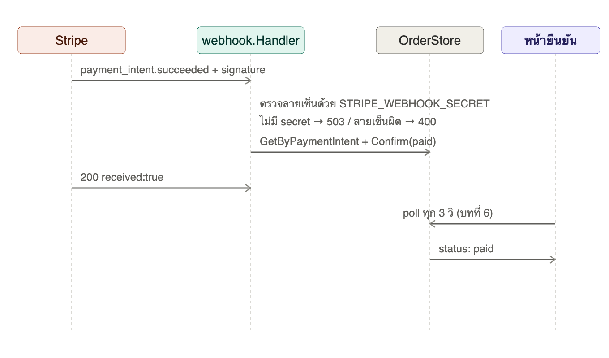
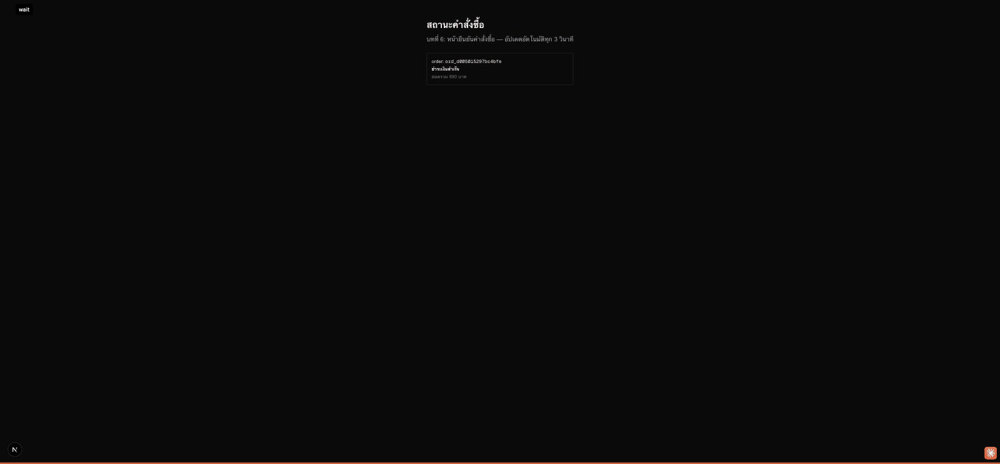

# บทที่ 7: Stripe webhook — ยืนยันการชำระเงินแบบ async

## เรียนบทนี้ไปทำไม

บทที่ 6 ทิ้งคำถามค้างไว้: อะไรจะทำให้ order เปลี่ยนจาก `pending_confirmation` เป็น `paid`?
คำตอบคือ **webhook** — Stripe เป็นฝ่าย push event มาบอกเราเมื่อผลการชำระเงินออกแล้วจริง ๆ
บทนี้สอนแนวคิดสำคัญของระบบการเงินทุกระบบ: **ห้ามเชื่อ input จากภายนอกโดยไม่ตรวจสอบลายเซ็น**
เพราะ endpoint webhook เป็น URL สาธารณะ ใครก็ส่ง POST มาได้ ถ้าไม่ตรวจสอบ ใครก็ปลอม
`payment_intent.succeeded` มาสั่งให้ order เป็น paid ได้ทั้งที่ไม่ได้จ่ายเงินจริง

## เป้าหมาย (goal)

1. เข้าใจว่าทำไม "checkout สำเร็จ" (บทที่ 5) ไม่เท่ากับ "จ่ายเงินสำเร็จจริง" (บทนี้)
2. ใช้ `stripe-go/webhook.ConstructEvent` ตรวจสอบลายเซ็น `Stripe-Signature` ด้วย
   `STRIPE_WEBHOOK_SECRET` ก่อนเชื่อ payload ใด ๆ
3. จับ event `payment_intent.succeeded` และ `payment_intent.payment_failed` แล้วอัปเดต
   order ที่ตรงกันผ่าน `OrderStore.GetByPaymentIntent`
4. ทำความเข้าใจว่าทำไม endpoint นี้ต้องตอบ `503` เมื่อไม่ได้ตั้งค่า secret เหมือนบทที่ 5

## ลำดับการทำงาน



## ทำไมต้องตรวจลายเซ็น ไม่ใช่แค่เชื่อ JSON body

`webhook.ConstructEvent(payload, header, secret)` คำนวณ HMAC-SHA256 ของ payload ด้วย
secret ที่ตั้งไว้ แล้วเทียบกับค่าที่ส่งมาใน header `Stripe-Signature` มีเพียง Stripe (และเราที่รู้
secret) เท่านั้นที่คำนวณลายเซ็นที่ถูกต้องได้ ใน `handler.go`:

```go
event, err := webhook.ConstructEvent(payload, r.Header.Get("Stripe-Signature"), h.signingSecret)
if err != nil {
    writeJSON(w, http.StatusBadRequest, ...)
    return
}
```

ถ้าไม่มีขั้นตอนนี้ ระบบจะเปิดช่องให้ใครก็ตามยิง POST ปลอมมาที่ `/api/webhooks/stripe` เพื่อ
"ปลดล็อก" order เป็น paid โดยไม่ต้องจ่ายเงินจริงเลย

## การทดสอบโดยไม่มี Stripe account จริง

เพราะ webhook ใช้ **HMAC ธรรมดา** ไม่ใช่ public-key cryptography เราจึงจำลองการทดสอบทั้งหมด
ได้ในเครื่องโดยไม่ต้องมี Stripe account จริง แค่ตั้ง `STRIPE_WEBHOOK_SECRET` เป็นค่าอะไรก็ได้
แล้วเซ็น payload ด้วย secret เดียวกัน (ดู `TestWebhookConfirmsOrderOnPaymentSucceeded` ที่ใช้
`webhook.GenerateTestSignedPayload` ของ stripe-go เอง) — เมื่อใช้งานจริงกับ Stripe จะต้องรัน

```bash
stripe listen --forward-to localhost:3001/api/webhooks/stripe
```

เพื่อรับ `whsec_...` จริงจาก Stripe CLI

## โครงสร้างโค้ดที่เพิ่มเข้ามา

```
server/internal/webhook/
  handler.go       - POST /api/webhooks/stripe, ตรวจลายเซ็น + อัปเดต order
  handler_test.go  - ทดสอบด้วย payload ที่เซ็นเองในเครื่อง
```

## ผลลัพธ์ที่ควรได้

Demo นี้จำลอง webhook event ด้วย signed payload ที่สร้างในเครื่อง (เทคนิคเดียวกับใน
`handler_test.go`) แล้วยิงไปที่ server ขณะหน้ายืนยันคำสั่งซื้อ (บทที่ 6) กำลัง poll อยู่ ภาพนี้คือ
สถานะหลัง webhook ยืนยันสำเร็จ — เปลี่ยนจาก "รอการยืนยันจาก Stripe" เป็น "ชำระเงินสำเร็จ"
โดยอัตโนมัติ ไม่ต้อง refresh หน้าเอง



## ทดสอบ

```bash
cd server && go test ./internal/webhook/...
```

ครอบคลุม: 503 เมื่อไม่มี secret, 400 เมื่อลายเซ็นผิด, อัปเดต order เป็น paid/failed ตาม event
type ที่ถูกต้อง

## สรุปสิ่งที่ได้เรียนรู้

- หลักการ "never trust unauthenticated webhook input" ด้วย signature verification
- ความแตกต่างระหว่าง synchronous response (checkout, settle) กับ asynchronous confirmation
  (webhook) ในระบบการเงิน
- เทคนิคทดสอบ integration กับ third-party webhook โดยไม่ต้องพึ่ง sandbox account จริง
- ครบ loop ทั้งหมดของ ACP: discover → checkout session → settle → confirm
