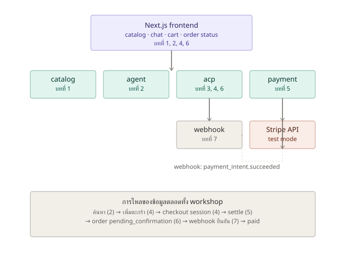
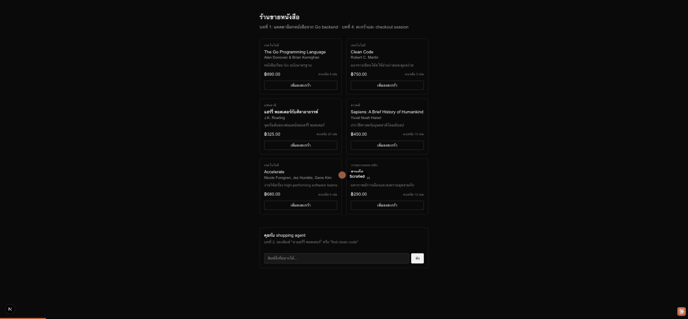

# บทที่ 8: สรุปรวม — เดโมแบบ end-to-end

## เรียนบทนี้ไปทำไม

บทนี้ไม่มีโค้ดใหม่ แต่มีเป้าหมายสำคัญไม่แพ้บทอื่น: **ต่อทุกชิ้นส่วนที่สร้างมาทั้ง 7 บทให้เห็นเป็น
เรื่องเดียวกัน** ตั้งแต่ผู้ใช้พิมพ์ประโยคภาษาคนใน chat ไปจนถึงเงินถูก settle จริงที่ Stripe และ
order เปลี่ยนสถานะแบบ real-time เมื่อ workshop จบ ผู้เรียนควรอธิบายได้ว่าทำไมแต่ละชิ้นส่วนต้อง
แยกกัน และทำไมต้องต่อกันตามลำดับนี้ ไม่ใช่ลำดับอื่น

## สถาปัตยกรรมสรุปรวม



## เส้นทางข้อมูลแบบเต็ม (recap)

| บท | ส่วนประกอบ | สิ่งที่เพิ่มเข้ามา |
|----|-------------|---------------------|
| 1 | `catalog` | แหล่งข้อมูลหนังสือ (Go + in-memory store) |
| 2 | `agent` | แปลข้อความอิสระเป็น intent พร้อม fallback rule-based |
| 3 | `acp` (feed) | product feed สำหรับ agent ภายนอกค้นพบสินค้า |
| 4 | `acp` (session) | checkout session ที่คำนวณราคาใหม่ + จองสต๊อกฝั่ง server |
| 5 | `payment` | settle จริงผ่าน Stripe PaymentIntent |
| 6 | `acp` (order) | แยกสถานะที่ผู้ใช้เห็น ออกจากสถานะภายใน พร้อม polling UI |
| 7 | `webhook` | ยืนยันผลการชำระเงินแบบ async ด้วยลายเซ็นที่ตรวจสอบได้ |

## ผลลัพธ์ที่ควรได้ (เดโมเต็ม)

วิดีโอนี้แสดงเส้นทางผู้ใช้จริงทั้งหมดในรันเดียว: พิมพ์คุยกับ agent ("อยากได้หนังสือ Accelerate")
→ เพิ่มหนังสือที่ agent แนะนำลงตะกร้าโดยตรงจากผลการค้นหา → สร้าง checkout session → กด
settle ผ่าน Stripe ระบบตอบ `503` อย่างสุภาพเพราะ workshop นี้ไม่ได้ผูก Stripe account จริง
(ตาม `.env.example`) — พฤติกรรมนี้ถูกต้องตามที่ออกแบบไว้ ถ้าต้องการเห็นเส้นทางแบบจ่ายเงินสำเร็จ
เต็มรูปแบบ (settle → pending_confirmation → webhook → paid) ดู demo ของบทที่ 5, 6 และ 7
ซึ่งจำลองด้วย signed webhook payload ในเครื่อง



## สิ่งที่ตั้งใจ "ไม่ทำ" ใน workshop นี้ และทำไม

- **ไม่ใช้ ORM หรือฐานข้อมูลจริง** — เก็บทุกอย่างแบบ in-memory เพื่อให้โฟกัสอยู่ที่กลไก ACP และ
  Stripe ไม่ใช่ data layer
- **ไม่ implement ACP ตามสเปกแบบครบถ้วน** — ตัดเหลือเฉพาะแนวคิดหลัก (feed, session,
  settle) ที่เพียงพอต่อการเข้าใจภาพรวม
- **ไม่มี authentication** — เพราะไม่ใช่จุดเน้นของ workshop เรื่อง agentic commerce
- **มี endpoint `/api/dev/seed_order`** ที่ไม่ใช่ส่วนหนึ่งของระบบจริง ใช้เพื่อสอน/สาธิตเท่านั้น
  (ดูบทที่ 6)

## แนวทางต่อยอดถ้าจะทำจริงในโปรดักชัน

1. เปลี่ยน in-memory store เป็นฐานข้อมูลจริง (Postgres) พร้อม transaction สำหรับการจองสต๊อก
2. ใส่ idempotency key ตอนเรียก Stripe เพื่อป้องกัน PaymentIntent ซ้ำเมื่อ retry
3. เพิ่ม authentication/authorization ให้ endpoint ที่ไม่ใช่ public feed
4. ลบ `/api/dev/*` endpoints ทั้งหมดออกก่อน deploy จริง
5. เพิ่มการจัดการ webhook event ซ้ำ (idempotent webhook handling ด้วย event id)
6. implement ACP ให้ตรงตามสเปกฉบับเต็มถ้าต้องการให้ agent จากแพลตฟอร์มอื่นเชื่อมต่อได้จริง

## ทดสอบทั้งระบบ

```bash
cd server && go test ./...
```

## สรุปภาพรวมทั้ง workshop

จาก 8 บทเรียนนี้ ผู้เรียนควรเข้าใจ:

- วิธีออกแบบ REST API ด้วย Go มาตรฐานแบบ layered (handler → store → domain model)
- วิธีให้ agent (ไม่ว่าจะ rule-based หรือ LLM-backed) กลายเป็นส่วนหนึ่งของ flow การซื้อขาย
- แนวคิดหลักของ Agentic Commerce Protocol: discovery feed, checkout session, settlement
- การ integrate กับ Stripe อย่างปลอดภัย ทั้งฝั่ง synchronous (PaymentIntent) และ asynchronous
  (webhook พร้อม signature verification)
- หลักการ graceful degradation และการเลือก HTTP status code ให้สื่อความหมาย
- การ commit งานเป็นก้อนเล็ก ๆ บ่อย ๆ ตามแนวทาง *Accelerate* เพื่อให้ trunk พร้อม deploy ได้
  ตลอดเวลา
