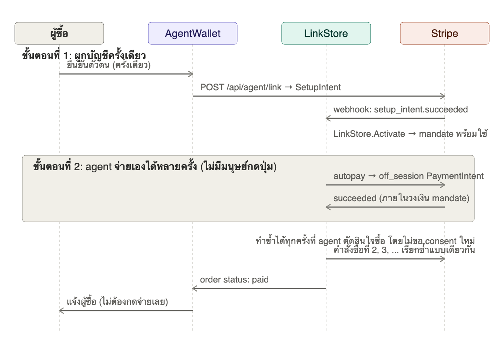
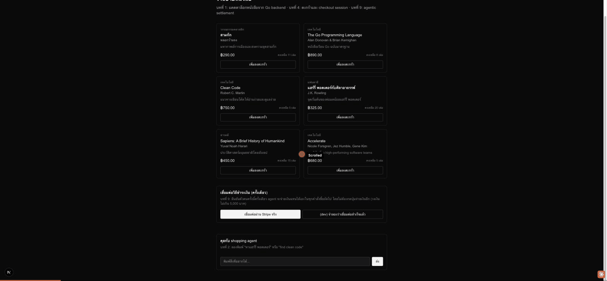

# บทที่ 9: Agentic settlement จริง — ผูกบัญชีครั้งเดียว agent จ่ายเองได้ตลอด

## เรียนบทนี้ไปทำไม

บทที่ 5 สอนกลไกของ Stripe `PaymentIntent` ได้ถูกต้อง แต่มีจุดอ่อนที่ผู้เรียนคนหนึ่งจับได้ตรงประเด็น:
**ถ้าผู้ซื้อต้องกดปุ่ม "จ่ายเงิน" เองทุกครั้งที่จะซื้อของ นั่นไม่ใช่ agentic payment** มันคือ
"assisted checkout" ที่ agent แค่ช่วยเตรียมตะกร้าให้ ส่วนการตัดสินใจจ่ายเงินยังเป็นของมนุษย์อยู่ดี

Stripe แก้ปัญหานี้จริงด้วยแนวคิด **Shared Payment Token** และ **Stripe Link Wallet Protocol**:
แยก "ตอนขอความยินยอม" ออกจาก "ตอนจ่ายเงินจริง" ผู้ซื้อยืนยันตัวตนกับ Stripe **ครั้งเดียว**
เพื่อสร้าง mandate ที่มีขอบเขต (วงเงินสูงสุด, ระยะเวลา) จากนั้น agent จ่ายเงินแทนได้เองทุกครั้ง
ที่ต้องการ โดยไม่มี UI ให้กดอีกเลย บทนี้จำลองกลไกนั้นด้วย Stripe API มาตรฐาน (SetupIntent +
off_session PaymentIntent) ซึ่งเป็นกลไกเดียวกับที่อยู่เบื้องหลัง Shared Payment Token

## เป้าหมาย (goal)

1. เข้าใจความแตกต่างระหว่าง **synchronous checkout** (บทที่ 5: มนุษย์กดจ่ายทุกครั้ง) กับ
   **agentic settlement** (บทนี้: มนุษย์ยินยอมครั้งเดียว, agent จ่ายเองได้เรื่อย ๆ)
2. ใช้ `SetupIntent` เพื่อผูกวิธีชำระเงินเข้ากับ Stripe Customer แบบใช้ซ้ำได้ (one-time linking)
3. ใช้ `PaymentIntent` แบบ `Confirm: true, OffSession: true` ให้ agent เรียกจ่ายเงินได้เอง
   โดยไม่ต้องมี client secret ให้มนุษย์ยืนยันอีก
4. ออกแบบ **mandate**: ขอบเขตของสิทธิ์ที่ยินยอมไว้ (วงเงินสูงสุด) ที่ agent ต้องเคารพทุกครั้ง
   ก่อนจ่ายเงินแทน

## ลำดับการทำงาน



## Mandate คืออะไร และทำไมต้องมี

ถ้า agent ถือ token ที่จ่ายเงินได้ไม่จำกัดวงเงิน นั่นคืออันตรายมาก บทนี้จึงให้ `Link` (คำเรียก
แบบง่ายของ mandate ในโค้ด) เก็บ `max_amount_cents` ไว้ตั้งแต่ตอน linking และ
`LinkStore.Authorize` ต้องผ่านการเช็คนี้ **ทุกครั้ง** ก่อนเรียก Stripe:

```go
link, err := h.links.Authorize(req.LinkID, session.TotalCents)
if err != nil {
    writeJSON(w, http.StatusForbidden, ...) // เกินวงเงิน หรือ link ไม่ active
    return
}
```

นี่คือหลักการเดียวกับที่ Shared Payment Token ทำจริง: token ไม่ได้แทน "สิทธิ์จ่ายเงินไม่จำกัด"
แต่แทน "สิทธิ์จ่ายเงินภายใต้เงื่อนไขที่ผู้ใช้ยินยอมไว้"

## ทำไมต้องรอ webhook ก่อน mandate จะ "active"

เช่นเดียวกับบทที่ 7 เราไม่เชื่อ client ที่บอกว่า "ผู้ใช้ยืนยันตัวตนสำเร็จแล้ว" — `LinkStore.Activate`
ถูกเรียกจาก `webhook.Handler` เท่านั้น เมื่อ Stripe ส่ง event `setup_intent.succeeded` มาพร้อม
ลายเซ็นที่ตรวจสอบได้ ทำให้ mandate เชื่อถือได้จริง ไม่ใช่แค่ผู้ใช้อ้างเอง

## เปรียบเทียบกับบทที่ 5

| | บทที่ 5 (`/api/agent/pay`) | บทที่ 9 (`/api/agent/autopay`) |
|---|---|---|
| ใครกดปุ่มจ่ายเงิน | มนุษย์ ทุกออเดอร์ | มนุษย์ครั้งเดียวตอน linking เท่านั้น |
| Stripe params | `Confirm` ไม่ตั้ง (รอ client confirm) | `Confirm: true, OffSession: true` |
| ต้องมี client secret | ต้องมี ให้ client ยืนยันต่อ | ไม่ต้องมี จบใน request เดียว |
| เหมาะกับ | การซื้อครั้งเดียว มนุษย์อยู่หน้าจอ | agent ตัดสินใจซื้อเองซ้ำ ๆ (subscription, auto-restock) |

## โครงสร้างโค้ดที่เพิ่มเข้ามา

```
server/internal/payment/stripe.go
  - CreateSetupIntent            สร้าง Customer + SetupIntent (linking)
  - CreateOffSessionPaymentIntent  agent จ่ายเองโดยไม่มี client ยืนยัน

server/internal/acp/
  link.go             - Link (mandate), LinkStore
  link_handler.go      - POST /api/agent/link, GET /api/agent/links/{id}
  autopay_handler.go   - POST /api/agent/autopay (จ่ายเองแบบ agentic)
  dev_handler.go        - เพิ่ม POST /api/dev/seed_link (จำลอง linking สำเร็จ)

server/internal/webhook/handler.go
  - เพิ่ม event type setup_intent.succeeded → LinkStore.Activate

web/
  lib/link.ts, lib/link-context.tsx  - state ของ wallet ที่เชื่อมต่อแล้ว
  lib/autopay.ts                      - เรียก autopay
  components/AgentWallet.tsx           - UI linking ครั้งเดียว
  components/CartPanel.tsx (แก้ไข)     - เพิ่มปุ่ม "ให้ agent จ่ายเงินอัตโนมัติ" คู่กับปุ่มเดิม
```

## ผลลัพธ์ที่ควรได้

Demo นี้แสดงการเชื่อมต่อวิธีชำระเงินครั้งเดียว (จำลองด้วย `/api/dev/seed_link` เพราะ workshop
นี้ไม่มี Stripe account จริง) จากนั้นสร้าง checkout session แล้วกดปุ่มสีเขียว "ให้ agent
จ่ายเงินอัตโนมัติ" — สังเกตว่าไม่มี client secret ไม่มีหน้า Stripe Checkout ให้กรอกบัตรอีกเลย
ระบบตอบ `503` อย่างสุภาพเพราะไม่มี `STRIPE_SECRET_KEY` จริง เหมือนบทที่ 5 (พฤติกรรมถูกต้อง
ตามที่ออกแบบไว้)



## ทดสอบ

```bash
cd server && go test ./internal/acp/... ./internal/webhook/...
```

ครอบคลุม: link เริ่มต้นที่ pending, activate ผ่าน webhook เท่านั้น, ปฏิเสธการจ่ายเงินเกินวงเงิน
mandate, ปฏิเสธ link ที่ยังไม่ active

## สรุปสิ่งที่ได้เรียนรู้

- ความแตกต่างระหว่าง "assisted checkout" กับ "agentic settlement" ที่แท้จริง
- กลไกเบื้องหลัง Shared Payment Token / Stripe Link: แยก consent ออกจาก settlement
- การออกแบบ mandate ที่มีขอบเขต (วงเงิน) เพื่อจำกัดความเสี่ยงเมื่อมอบสิทธิ์จ่ายเงินให้ agent
- `SetupIntent` + off_session `PaymentIntent` คือกลไกมาตรฐานของ Stripe ที่ทำให้สิ่งนี้เป็นไปได้
  โดยไม่ต้องพึ่ง Stripe Link แบบ proprietary
